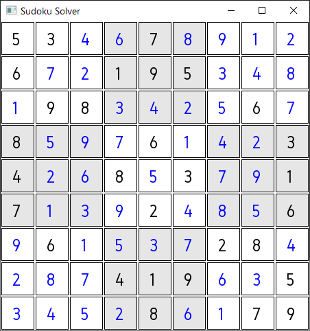

# SudokuSolver

This gui application solves Sudoku puzzles by backtracking.

Controls:

- Speed up (+)
- Slow down (-)
- Pause algorithm (space)
- Clear Sudoku (c)
- Load example (e)
- Set value (mouse over + number)

Uses SFML as graphics backend and Gidole.ttf (OFL).
